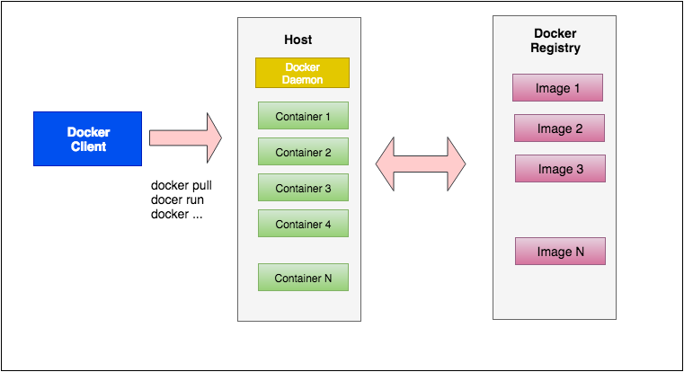
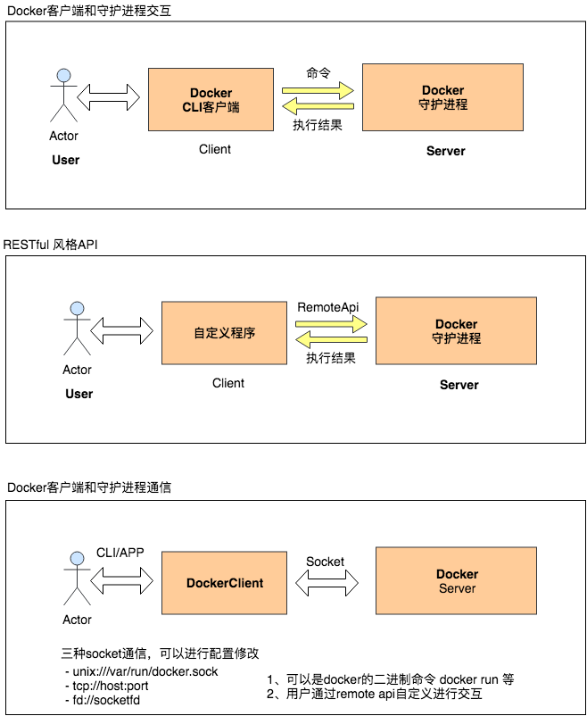

# docker-学习记录

使用Mac上进行docker的学习

## 0、环境初始化

- 方式一 `brew cask install docker` 这种安装方式不带GUI存命令行操作
- 方式二 下载 [Docker Desktop for Mac](https://hub.docker.com/editions/community/docker-ce-desktop-mac) 带一套可视化软件和Docker环境


## 2、Docker 简介

### 2.1 什么是容器

- 一种虚拟化的方案
- 操作系统级别的虚拟化
- 只能运行相同或相似内核的操作系统
- 依赖于Linux内核特性：`Namespace`和`Cgroups` (`Control Group`)

### 2.2 什么是Docker

- 将应用程序自动部署到容器
- Go语言开源引擎 Github地址: https://github.com/docker/docker
- 2013年初 dotCloud
- 基于Apache 2.0 开源授权协议发行 


### 2.3 Docker目标（特点）

- 提供简单轻量的建模方式
- 职责的逻辑分离
- 快速高效的开发生命周期
- 鼓励使用面向服务的架构

### 2.4 Docker的使用场景

- 使用Docker容器开发，测试，部署服务
- 创建隔离的运行环境
- 搭建测试环境
- 构建多用户的平台即服务（PaaS Platform as a Service）基础设施
- 提供软件即服务（SaaS Software as a Service）应用程序
- 高性能，超大规模的宿主机部署


## 3、Docker的基本组成




### 3.1 Docker客户端/守护进程




#### 连接方式

- 客户端和守护进程通信
	- unix:///var/run/docker.sock  (Docker 默认)
	- tcp://host:port
	- fd://socketfd

- 守护进程启动项修改
	- 详细参考[官网文档](https://docs.docker.com/engine/reference/commandline/cli/)
	- 修改启动配置文件(下面已Mac为例) 其余参考[官方文档](https://docs.docker.com/engine/reference/commandline/dockerd/#daemon-configuration-file)
		- 方式一直接修改 `vim ~/.docker/daemon.json`
		- 方式二 Docker->Preferences->Daemon->Advanced-> 直接进行配置json格式数据即可

- 访问远程的docker服务
	- `curl --unix-socket /var/run/docker.sock http:/v1.39/info`
	- [remote api](https://docs.docker.com/develop/sdk/)

### 3.2 Docker Image 镜像

- 容器的基石
- 层叠的只读文件系统
- 联合加载（union mount）

### 3.3 Docker Container 容器

#### 3.3.1 特点

- 通过镜像启动
- 启动和之行阶段
- 写时复制（copy on write）


#### 3.3.2 基本操作

- 启动容器 `docker run [OPTIONS] IMAGE [COMMAND] [ARG...]`
	- 1、单次命令容器 `docker run ubuntu echo 'Hello World'`

	> 表示启动容器并执行 echo 命令 对应的参数 为 'Hello World'

	- 2、交互模式启动 `docker run -i -t ubuntu /bin/bash`

- 列出容器 `docker ps [-a] [-l]`
	> -a 列出全部容器， -l列出最近的一个容器
	> 不指定参数返回的是在运行的容器

- 查看指定容器的详细信息 
	- `docker inspect [CONTAINER ID|NAMES]`

- 自定义容器名字执行
	- `docker run --name=container_name -i -t ubuntu /bin/bash`

- 重新启动停止容器
	- `docker start [-i] 容器名|或id`
	> -i 交互模式启动

- 删除已经停止的容器
	- `docker rm containerid`


#### 3.3.3 守护式容器

> 什么是是守护式容器：能够长期运行，没有交互式回话，适合运行应用程序和服务

- 启动方式一 
	- docker run -i -t IMAGE /bin/bash
	- Contrl + p + q 退出
	> 此时使用 `docker container ps` 查看容器是在运行的状态

	- docker attach 容器名|或id 
	> 重新进入刚才在后台运行的容器

- 使用RUN 启动守护式容器
	- docker run --name=mako1 -d ubuntu /bin/bash -c "while true; do echo hello world; sleep 1; done"
	> -d 已后台模式运行容器，命令结束后依旧会退出 + 加上循环保持容器不退出

- 查看容器日志查看容器运行
	- docker logs [-f] [-t] [-tail] 容器名|或id
	> -f --follows=true|false 默认为false	    一直跟踪日志变化并返回结果
	> -t --timestamps=true|false 默认为false 在返回结果上加上时间戳
	> --tail="all" 							返回最后多少条日志

	- docker logs -f  mako1
	- docker logs -ft mako1
	- docker logs -ft --tail=10 mako1

- 通过top命令查看运行中容器的进程情况
	- docker top mako1

- 在运行中的容器中启动新的进程
	- docker exec [-d] [-i] [-t] 容器名|或id [comamnd] [arg...]
	- docker exec -i -t /bin/bash
	- docker top mako1 查看新的进程是否存在

- 停止守护式容器
	- docker stop 容器名|或id	 会进行等待
	- docker kill 容器名|或id  快速停止

> 详细命令查看 docker --help 查看


#### 3.3.4 在容器中部署一个静态网站

> 通过NGINX部署静态网站

-  容器的端口映射
	- docker run [-P] [-p]
		- -P --public-all=true|false 默认为false 为容器暴露所有端口进行映射
			- docker run -P -i -t ubuntu /bin/bash
		- -p --publish=[]  指定映射哪些容器的端口
			- containerPort 只指定容器端口，宿主机端口随机映射
				- docker run -p 80 -i -t ubuntu /bin/bash
			- hostPort:containerPort 同时指定宿主机端口和容器端口
				- docker run -p 8080:80 -i -t ubuntu /bin/bash
			- ip:containerPort 指定IP和容器端口
				- docker run -p 0.0.0.0:80 -i -t ubuntu /bin/bash
			- ip:hostPort:containerPort 同时指定IP 宿主机端口和容器端口
				- docker run -p 0.0.0.0:8080:80 -i -t ubuntu /bin/bash

- 部署的流程
	- 创建映射80端口的交互式容器
	- 安装Nginx， vim
	- 创建静态页面
	- 修改Nginx配置文件
	- 运行Nginx
	- 验证网站访问

```
docker run -p 80 --name=web -i -t ubuntu /bin/bash
apt-get update
apt-get install -y nginx vim
mkdir /var/www/html && cd /var/www/html
vim index.html 进行编辑

- 编辑配置文件
whereis nginx  # 查找nginx安装信息 nginx: /usr/sbin/nginx /usr/lib/nginx /etc/nginx /usr/share/nginx
ls /etc/nginx/

vim /etc/nginx/sites-enabled/default  # 修改root根目录

nginx # 启动
Contrl + p Contrl + q 退出

- 使用docker ps 查看 发现 `0.0.0.0:32769->80/tcp` 把32769端口映射到容器中的80端口

➜  ~ docker ps
CONTAINER ID        IMAGE               COMMAND             CREATED             STATUS              PORTS                   NAMES
8985abb1f0c8        ubuntu              "/bin/bash"         7 minutes ago       Up 7 minutes        0.0.0.0:32769->80/tcp   web
➜  ~ docker port web
80/tcp -> 0.0.0.0:32769
➜  ~ docker top web
PID                 USER                TIME                COMMAND
28314               root                0:00                /bin/bash
29952               root                0:00                nginx: master process nginx
29953               xfs                 0:00                nginx: worker process
29954               xfs                 0:00                nginx: worker process

```

- 使用宿主机的地址访问网站
	- curl http://localhost:32769/
	- http://localhost:32769/
	- http://0.0.0.0:32769/

- 使用容器的IP地址访问
	- docker inspect web
	- 找到 "IPAddress": "172.17.0.2"
	- 直接访问 


### 3.4 Docker Registry 仓库

- 共有 Docker Hub
- 私有


## 4、Docker 容器相关技术简介

### 4.1 Namespace 命名空间

- 编程语言
	- 封装 -> 代码隔离
- 操作系统
	- 系统资源隔离
	- 进程、网络、文件系统...

- Docker提供五种隔离
	- PID (Process ID) 进程隔离
	- NET (Network) 管理网络接口
	- IPC (InterProcess Communication) 管理跨进程通信的访问
	- MUT (Mount)管理挂载点
    - UTS (Unix Timesharing System) 隔离内核和版本标识

### 4.2 Control Groups 控制组

- 用来分配资源，来源于google 
- Linux kernel 2.6.24@2007 整合

- 提供的功能
	- 资源限制
	- 优先级设定
	- 资源计量
	- 资源控制（挂起，恢复）

### 4.3 Docker容器的能力

- 文件系统隔离
	- 每个容器都有自己的root文件系统
- 进程隔离
	- 每个容器都运行在自己的进程环境中
- 网络隔离
	- 容器间的虚拟网络接口和IP地址都是分开的
- 资源隔离和分组
	- 使用cgroups将CPU和内存之类的资源独立分配给每个Docker容器


## 5、Docker 的安装和配置

### 5.1 在Ubuntu中安装

- 检查环境是否支持
    - uname -a
    - ls -l /sys/class/misc/device-mapper

- 方式一 版本比较旧
	- `sudo apt-get install -y docker.io`
	- `source /etc/bash_completion.d/docker.io`

- 方式二
	- 检查APT的https支持，查看/usr/lib/apt/methods/https 文件是否存在
	    - apt-get update
	    - apt-get install -y apt-transport-https
	- 添加Docker的APT仓库
		- echo deb https://get.docker.com/ubuntu docker main >/etc/apt/sources.list.d/docker.list
	- 添加仓库的key
		- apt-key adv --keyserver hkp://keyserver.ubuntu.com:80 --recv-keys 36A1D7869245C8950F966E92D8576A8BA88D21E9
	- 安装
		- apt-get update
		- apt-get install -y lxc-docker

- Docker提供的简易安装方式
	- sudo apt-get install-y curl
	- curl -sSL https://get.docker.com/ | sudo sh 

- 新版本Docker安装
	- [参考官网文档](https://docs.docker-cn.com/engine/installation/linux/docker-ce/ubuntu/)

- 使用非root用户
	- sudo groupadd docker
	- sudo gpasswd -a user docker
	- sudo service docker restart


### 5.2 在window中安装

- 旧版本Docker

- 新版本Docker
	- 直接下载windows的docker进行安配置即可
	- [参考](https://docs.docker-cn.com/docker-for-windows/install/#start-docker-for-windows)

### 5.3 在MacOS中安装

- [参考官网文档](https://docs.docker-cn.com/docker-for-mac/install/#install-and-run-docker-for-mac)


#### 参考

- 1、[https://www.jishuwen.com/d/2ETn](https://www.jishuwen.com/d/2ETn)
- 2、[https://yeasy.gitbooks.io/docker_practice/](https://yeasy.gitbooks.io/docker_practice/)
- 3、[https://zhuanlan.zhihu.com/p/35792864](https://zhuanlan.zhihu.com/p/35792864)
- 4、[https://www.jianshu.com/p/9e11be3d74f0](https://www.jianshu.com/p/9e11be3d74f0)
- 5、[https://www.zhihu.com/question/20387284](https://www.zhihu.com/question/20387284)
- 6、[https://www.raywenderlich.com/9159-docker-on-macos-getting-started](https://www.raywenderlich.com/9159-docker-on-macos-getting-started)

#### 待学习

- Github + Docker Hub 实现自动构建镜像 [https://blog.csdn.net/bbwangj/article/details/82084480](https://blog.csdn.net/bbwangj/article/details/82084480)